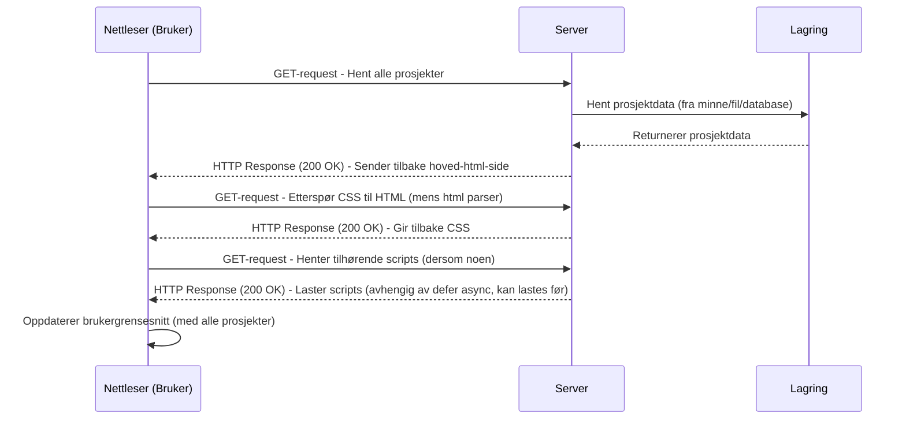

```mermaid
sequenceDiagram
    participant Client-side as Nettleser (Bruker)
    participant Server-side as Server
    participant Lagring as Lagring

    Client-side->>Server-side: GET-request - Hent alle prosjekter
    Server-side->>Lagring: Hent prosjektdata (fra minne/fil/database)
    Lagring-->>Server-side: Returnerer prosjektdata
    Server-side-->>Client-side: HTTP Response (200 OK) - Sender tilbake hoved-html-side
    Client-side->>Server-side: GET-request - Etterspør CSS til HTML (mens html parser)
    Server-side-->>Client-side: HTTP Response (200 OK) - Gir tilbake CSS
    Client-side->>Server-side: GET-request - Henter tilhørende scripts (dersom noen)
    Server-side-->>Client-side: HTTP Response (200 OK) - Laster scripts (avhengig av defer async, kan lastes før)
    Client-side->>Client-side: Oppdaterer brukergrensesnitt (med alle prosjekter)

```