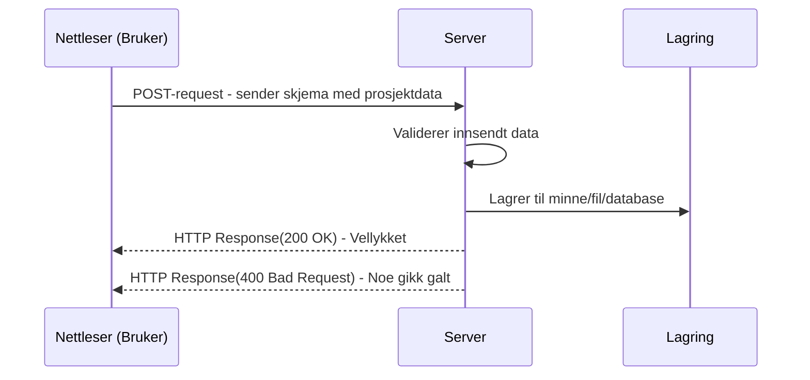

```mermaid
sequenceDiagram
    participant Client-side as Nettleser (Bruker)
    participant Server-side as Server
    participant Lagring as Lagring

    Client-side->>Server-side: POST-request - sender skjema med prosjektdata
    Server-side->>Server-side: Validerer innsendt data
    Server-side->>Lagring: Lagrer til minne/fil/database
    
    Server-side-->>Client-side: HTTP Response(200 OK) - Vellykket
    Server-side-->>Client-side: HTTP Response(400 Bad Request) - Noe gikk galt


    
   
    
```
